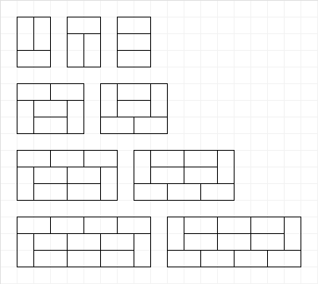

# BOJ-02133 / 타일 채우기  
devgeon, 2024.09.20, Java 11  
https://www.acmicpc.net/problem/2133  

## Comment
- 3 × 2 크기의 벽을 채우는 경우의 수는 3가지 입니다.
- 3 × 4 크기의 벽을 채우는 경우의 수는 2가지 입니다. `(이전에 나온 패턴의 조합으로만 표현되는 경우 제외)`
- 3 × 6 크기의 벽을 채우는 경우의 수는 2가지 입니다. `(이전에 나온 패턴의 조합으로만 표현되는 경우 제외)`
- 3 × $2k$, $(k \ge 2)$ 크기의 벽을 채우는 경우의 수는 2가지 입니다. `(이전에 나온 패턴의 조합으로만 표현되는 경우 제외)`
- 
- N이 홀수인 경우 벽을 완전히 채울 수 없으므로 경우의 수는 0입니다.
- 짝수 $n$에 대하여 $F(n)$을 3 × $n$ 크기의 벽을 채우는 경우의 수라고 했을 때, 점화식은 다음과 같습니다.
- $F(n) = F(n-2) \times 3 + F(n-4) \times 2 + F(n-6) \times 2 + F(n-8) \times 2 + \cdots + F(0) \times 2$  
	   $= F(n-2) \times 3 + ( F(n-4) + F(n-6) + F(n-8) + \cdots + F(0) ) \times 2$
- 위 식에서 $n$자리에 $n-2$를 넣어 정리하면  
  $F(n-2) = F(n-4) + ( F(n-4) + F(n-6) + F(n-8) + \cdots + F(0) ) \times 2$  
  $F(n-2) - F(n-4) = ( F(n-4) + F(n-6) + F(n-8) + \cdots + F(0) ) \times 2$
- 이를 처음 식에 대입하여 정리하면  
  $F(n) = F(n-2) \times 4 - F(n-4)$
- $n$이 0일 때는 타일을 0개 사용하여 채우는 1가지 방법이 있다고 생각합니다.
- 위 내용대로 dynamic programming을 적용하여 풀이합니다.
